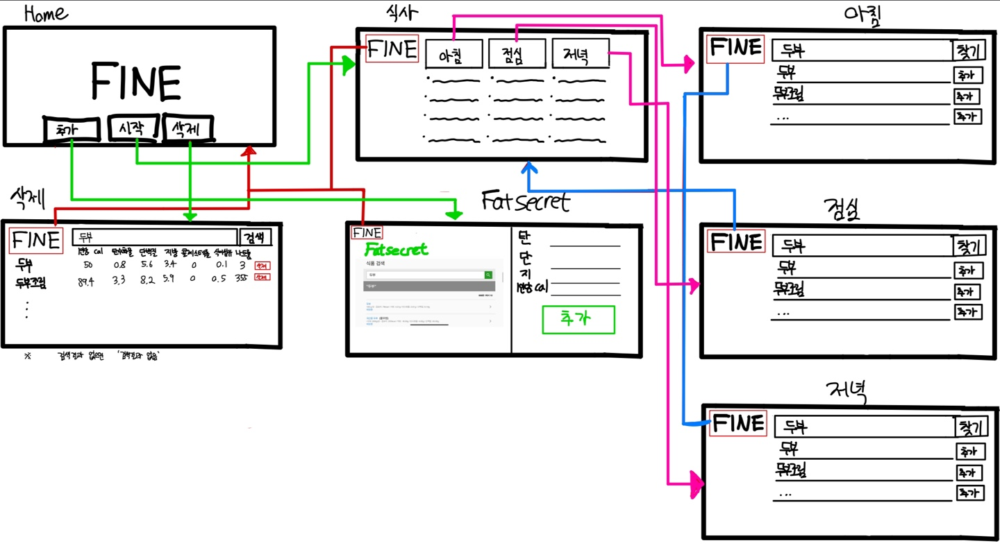

# 🥗 FINE (Fit, Intelligent, Nutrition, Eat)
### : 개인 맞춤형 영양 데이터 관리 및 식단 분석 시스템


---

## 📋 1. 프로젝트 개요 (Overview)
**"정적 데이터의 DB화 및 결측 데이터 보완 프로세스 구축"**
공공데이터포털의 식품 영양 정보(CSV)를 관계형 데이터베이스(SQLite)로 구축하여 검색 및 분석이 가능한 형태로 가공했습니다. 
또한 공공 데이터에 존재하지 않는 음식 정보는 외부 레퍼런스(FatSecret)와 교차 검증하여 사용자가 직접 데이터를 확충할 수 있는 **하이브리드 데이터 수집 시스템**을 구현했습니다.

* **개발 기간:** 2023.11.11 ~ 2023.12.16
* **참여 인원:** 2명


## 🛠 2. 시스템 아키텍처 및 데이터 흐름 (Data Flow Architecture)
<strong>"기존 데이터 활용(농림수산식품교육문화정보원 Data)"</strong>과 <strong>"신규 데이터 적재(농림수산식품교육문화정보원 Data에 없는 식품 정보)"</strong>의 프로세스를 명확히 분리하여 설계했습니다.


*(기획 단계에서 설계한 데이터 로직 및 User Flow)*

* **Workflow:**
    1. **Batch Ingestion:** 공공데이터 CSV 파일을 파이썬 스크립트를 통해 SQLite DB로 일괄 변환 (초기 데이터셋 구축).
    2. **Search & Gap Analysis:** 사용자가 음식을 검색했을 때 DB에 데이터가 없으면, `FatSecret` 외부 링크를 제공하여 성분 확인 유도.
    3. **Manual Enrichment (Human-in-the-Loop):** 확인한 영양 성분을 사용자가 웹 폼에 직접 입력하여 DB에 영구 저장 (데이터셋 확장).

<br>

## 💾 3. 데이터베이스 설계 (Database Modeling)
분석의 기초가 되는 데이터 무결성을 위해 `SQLite`를 활용한 관계형 데이터베이스 구조를 설계했습니다.

### 3-1. ERD (Entity Relationship Diagram) 구조
| Table Name | Description | Key Attributes |
|:---:|:---|:---|
| **food_data** | 전체 음식 영양 정보 마스터 테이블 | `식품코드(PK)`, `음식명`, `칼로리`, `탄수화물`, `단백질` 등 |
| **breakfast** | 아침 식단 기록 테이블 | `식품코드(FK)`, `음식명`, `영양성분 데이터` |
| **lunch** | 점심 식단 기록 테이블 | `식품코드(FK)`, `음식명`, `영양성분 데이터` |
| **dinner** | 저녁 식단 기록 테이블 | `식품코드(FK)`, `음식명`, `영양성분 데이터` |

> **💡 설계 의도 (Analyst's View):**
> * **CSV 데이터 정규화:** 원본 CSV 파일에는 '음식명'은 같으나 '조리법/브랜드'에 따라 영양 성분이 다른 중복 데이터가 다수 존재했습니다. 이를 구분하기 위해 **임의의 `식품코드`를 생성하여 PK(기본키)로 설정**, 데이터의 유일성(Uniqueness)을 보장했습니다.

<br>

## 💻 4. 핵심 기능 및 로직 (Core Logic)

### 4-1. 데이터 공백 해결을 위한 하이브리드 수집 전략
공공 데이터의 한계(최신 식품 누락 등)를 보완하기 위해, 사용자가 데이터 관리의 주체가 되는 **Manual Data Entry** 인터페이스를 구축했습니다.

* **Process:** `검색 결과 없음` → `식단 추가 페이지에서 음식 검색` → `해당 음식 정보가 있는 FatSecret 사이트 연결` → `사용자 성분 확인` → `Add Form 입력` → `DB Insert`
* **Insight:** 웹 크롤링이나 API를 맹목적으로 사용할 경우 발생할 수 있는 부정확한 데이터 유입을 방지하고, 사용자가 직접 확인한 검증된 데이터만 DB에 적재되도록 유도했습니다.

### 4-2. 동적 쿼리를 활용한 데이터 필터링
사용자가 설정한 다양한 조건(음식명, 칼로리 상한선 등)에 맞춰 데이터를 정확하게 추출하기 위해 Python에서 SQL 쿼리를 동적으로 생성하는 로직을 구현했습니다.

```python
# FINE.py : 조건부 필터링 로직
def search_foods(keyword=None, calorie_limit=None):
    query = "SELECT * FROM food_data WHERE 1=1"
    params = []
    
    # 음식명 포함 검색 조건
    if keyword:  
        query += " AND 음식명 LIKE ?"
        params.append(f"%{keyword}%")
    
    # 칼로리 필터링 조건
    if calorie_limit is not None:  
        query += " AND 칼로리 <= ?"
        params.append(calorie_limit)
    
    cursor.execute(query, params)
    return cursor.fetchall()
```

## 🚀 5. 트러블 슈팅 (Problem Solving)

### ⚠️ Issue: CSV 원본 데이터의 중복 및 고유 식별자 부재
* **상황 (Problem):** 농림수산식품교육문화정보원 CSV 원본 데이터를 분석하던 중, '고추장아찌', '숙주나물'과 같이 **음식명은 동일하지만 영양 성분(탄수화물, 단백질, 지방 등)이 다른 데이터**가 다수 발견되었습니다.
    * 원본 데이터에 고유 ID가 없어, 이름만으로는 특정 데이터를 정확히 지칭(Targeting)하여 수정하거나 삭제하는 것이 불가능했습니다.

* **해결 (Solution):**
    1. **데이터 전처리(Preprocessing):** CSV를 DB로 적재(Loading)하는 과정에서, 각 행(Row)마다 고유한 `식품코드`를 생성하여 부여했습니다.
    2. **스키마 최적화:** DB 설계 시 `음식명`이 아닌 `식품코드`를 <strong>Primary Key(기본키)</strong>로 설정하여 데이터의 유일성을 보장했습니다.
    3. **로직 변경:** 웹 서비스의 삭제/수정 기능이 사용자가 눈으로 보는 '이름'이 아니라, 내부적인 '코드'를 기준으로 동작하도록 쿼리를 수정했습니다.

* **성과 (Result):** 동명이인(同名異人) 데이터 간의 충돌을 방지하고, 데이터 관리(CRUD)의 **정확도를 확보**했습니다.


## 📝 6. 프로젝트 회고 (Retrospective)

### 📊 "데이터의 '생성 과정'을 이해해야 한다"
이 프로젝트는 단순히 웹 서비스를 만드는 것을 넘어, <strong>"Raw Data(CSV)가 어떻게 가치 있는 Database로 변환되는가"</strong>를 경험한 엔지니어링 프로젝트였습니다.

1. **ETL 프로세스의 체화:** 정적인 CSV 파일을 파싱(Extract)하여 포맷을 다듬고(Transform), SQLite DB에 저장(Load)하는 과정을 직접 코드로 구현하며 데이터 엔지니어링의 기초를 다졌습니다.

2. **Human-in-the-Loop (인간 참여형 데이터 수집):**
   모든 데이터를 자동으로 가져오는 대신, **'검색 결과 없음 → 외부 링크 확인 → 사용자 직접 입력'**이라는 프로세스를 설계했습니다. 이는 데이터의 공백(Missing Value)을 사용자의 집단지성으로 채우고, 동시에 검증된 데이터만 쌓이게 만드는 **데이터 품질 관리 전략**이었습니다.

3. **스키마 설계의 중요성:**
   초기 기획 단계에서 테이블을 제대로 정규화하지 않으면, 나중에 쿼리가 얼마나 복잡해지는지 몸소 체험했습니다. 이를 통해 분석하기 좋은 데이터 구조(Schema)를 설계하는 역량을 기를 수 있었습니다.
